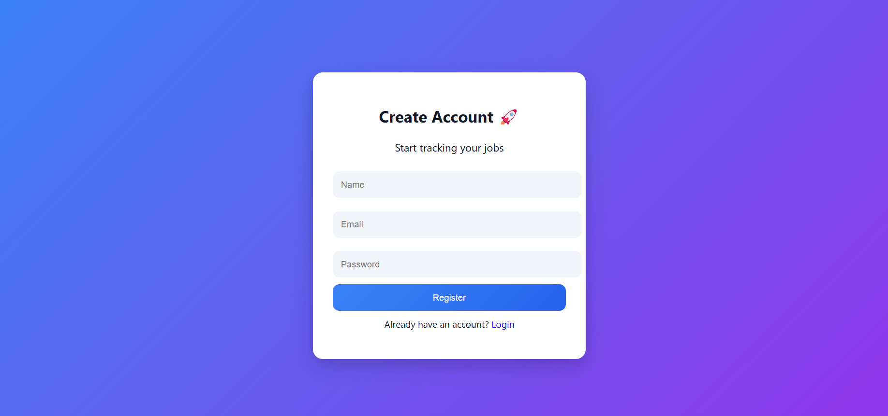

# 🚀 AI Job Tracker & Cover Letter Generator

A full-stack web application that helps users track job applications and generate AI-powered cover letters.

---

## 📌 Features

- 🔐 User Authentication (Login/Register using JWT)
- 📊 Dashboard with job statistics
- ➕ Add, update, and delete job applications
- 🔍 Search and filter jobs by status
- 🤖 AI Cover Letter Generator
- 📥 Download generated cover letter (TXT/PDF)
- 🌙 Dark & Light Mode UI

---

## 🛠️ Tech Stack

### Frontend
- React.js
- CSS (Custom Styling)

### Backend
- Node.js
- Express.js

### Database
- MongoDB (Mongoose)

### AI Integration
- OpenRouter API (for generating cover letters)

### Authentication
- JWT (JSON Web Token)
- bcryptjs

---

## ⚙️ Installation & Setup

### 1️⃣ Clone the repository
```bash
git clone https://github.com/your-username/job-tracker.git
cd job-tracker


### 2 Setup Backend

cd server
npm install
npm start

### 3 Setup frontent
cd client
npm install
npm run dev


🧠 How AI Works
User enters job details (company, role, skills)
Backend sends request to OpenRouter API
AI generates a customized cover letter
Response is displayed in UI

